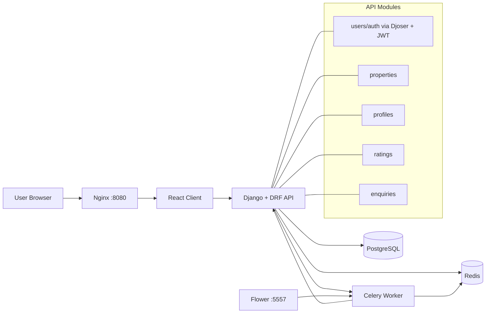

# Django Real Estate

Full-stack real estate application with a Django REST API, React client, PostgreSQL persistence, and Celery for asynchronous workflows.

## High-Level Architecture



## Stack

- Backend: Django 3.2, Django REST Framework, Djoser, SimpleJWT
- Frontend: React 17, Redux Toolkit, React Router
- Data: PostgreSQL
- Async: Celery, Redis, Flower
- Infra: Docker, Docker Compose, Nginx
- Quality: Pytest, Flake8, Black, isort

## Setup Instructions

### Prerequisites

- Docker Desktop (or Docker Engine + Docker Compose)
- GNU Make

### 1) Configure environment variables

Copy the template and fill required values:

```bash
cp .env.example .env
```

Minimum values to set in `.env`:

```env
SECRET_KEY=<django-secret>
DEBUG=True
ALLOWED_HOSTS=localhost 127.0.0.1
POSTGRES_ENGINE=django.db.backends.postgresql
POSTGRES_USER=<db-user>
POSTGRES_PASSWORD=<db-password>
POSTGRES_DB=<db-name>
PG_HOST=postgres-db
PG_PORT=5432
SIGNING_KEY=<jwt-signing-key>
EMAIL_HOST=<smtp-host>
EMAIL_HOST_USER=<smtp-user>
EMAIL_HOST_PASSWORD=<smtp-password>
EMAIL_PORT=587
CELERY_BROKER=redis://redis:6379/0
CELERY_BACKEND=redis://redis:6379/0
DOMAIN=localhost:8080
```

### 2) Build and start the stack

```bash
make build
```

This starts:
- `api` (Django)
- `client` (React dev server inside Docker)
- `postgres-db`
- `redis`
- `celery_worker`
- `flower`
- `nginx`

### 3) Run migrations

```bash
make migrate
```

### 4) Optional: create an admin user

```bash
make createsuperuser
```

### 5) Open the app

- Application: `http://localhost:8080`
- Celery Flower: `http://localhost:5557`

## Development Commands

- `make up` - start containers (no rebuild)
- `make down` - stop containers
- `make showlogs` - stream docker logs
- `make makemigrations` - generate migrations
- `make collectstatic` - collect static assets
- `make test` - run tests with coverage
- `make flake8` - lint Python code
- `make black` / `make isort` - format imports and code

## Design Decisions & Trade-offs

- Django REST Framework + Djoser/SimpleJWT: fast implementation of auth and API patterns, but couples auth flows to package conventions and limits flexibility for deeply custom identity flows.
- Docker Compose as the primary dev workflow: reproducible onboarding and parity across machines, with the trade-off of slower feedback loops than running parts natively.
- Redis shared by Celery broker/result backend: operationally simple and low overhead for this scale, but creates a single dependency that affects background processing when degraded.
- Celery for async email/background work: keeps API response time predictable, but introduces eventual consistency and requires workers/monitoring to be healthy.
- Modular app split (`apps.users`, `apps.properties`, `apps.enquiries`, etc.): clearer domain boundaries and easier ownership, but requires stricter cross-app contracts to avoid circular coupling.
- Nginx reverse proxy in front of services: realistic production-aligned routing and static/media serving, while adding one more moving part for local debugging.
